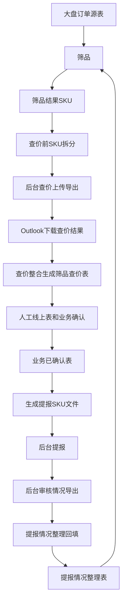

# 新人价自动化 Workflow 项目说明

更新时间：2026-08-01  
当前版本：工作流向导测试版  
项目路径：`D:\hansiying.1\Desktop\新人价自动化工具`

## 1. 项目概述

### 项目名称

新人价自动化 Workflow

### 项目目的

减少运营在新人价提报中的重复操作，将“筛品、查价、整合、提报、审核整理、复提判断”等规则化动作交给本地工具处理。

### 目标用户

运营人员。

### 自动化边界

本项目不是完全无人值守系统。当前定位为“半自动工作流”：

- 工具负责批量处理、字段识别、规则过滤、文件生成、后台路径点击、邮件下载、状态整理。
- 人工负责取数、业务沟通、最终风险确认、真实提报确认、是否导出审核结果确认。

## 2. 原流程与当前流程

### 原人工流程

1. 后台/取数中心下载大盘订单数据。
2. 人工筛品。
3. 人工拆 SKU 文件。
4. 后台查价上传。
5. 等邮件并下载查价结果。
6. Excel 合并查价结果。
7. 计算新人价。
8. 迁移线上表，发业务/采销确认。
9. 收到确认结果后拆提报文件。
10. 后台逐个文件提报。
11. 后台导出审核/提报情况。
12. Excel 归因、分类、整理下一轮复提品池。

### 当前工具流程

1. 工具筛品并输出 SKU。
2. 工具拆分查价前 SKU。
3. 工具进入后台查价，上传并导出到邮箱。
4. 工具从 Outlook 下载查价结果。
5. 工具整合查价结果，计算新人价，输出筛品查价表。
6. 人工发业务确认。
7. 工具读取业务确认表，生成提报 SKU PART 文件。
8. 工具安全模式/真实模式执行后台提报。
9. 工具导出审核情况，并从 Outlook 下载。
10. 工具整理审核状态，回填最终表，形成下轮复提依据。

## 3. 当前完成状态

| 模块 | 入口 | 状态 | 备注 |
| --- | --- | --- | --- |
| 筛品 | 菜单 1 / 工作流 9→1 | 已完成 | 支持初次提报和复提候选；过程记录合并日志和审核。 |
| 查价前 SKU 拆分 | 菜单 2 / 工作流 9→1 | 已完成 | 默认 5000 条/份。 |
| 本地流程 | 菜单 3 | 已完成 | 筛品 + 拆分。 |
| 后台查价上传导出 | 菜单 4 / 工作流 9→1 | 已完成 | 已适配新版“近N天最低价查询”入口。 |
| Outlook 下载查价结果 | 菜单 5 / 工作流 9→1 | 已完成 | 下载查价邮件结果。 |
| 配置查看 | 菜单 6 | 已完成 | 展示核心配置，旧版名单配置不再要求使用。 |
| 查价整合新人价 | 菜单 7 / 工作流 9→1 | 已完成 | 当前新版导出价格字段为“价格”。 |
| 提报文件生成 | 菜单 8→1 / 工作流 9→2 | 已完成 | 业务确认表空白默认参加。 |
| 后台批量提报 | 菜单 8→2 / 工作流 9→3 | 已完成 | dry_run / upload_only / submit 三模式。 |
| 后台审核导出 | 菜单 8→3 / 工作流 9→4 | 已完成 | 可导出并从 Outlook 下载。 |
| 提报情况整理回填 | 菜单 8→4 / 工作流 9→4 | 已完成 | 回填提报状态、标签、详情、采销确认、记录数。 |
| 工作流向导 | 菜单 9 | 已完成基础版 | 串联阶段并写入批次清单。 |
| 测试隔离目录 | run_test.bat | 已完成 | 所有测试文件写入 test_workspace。 |

## 4. 已完成的重要改造

### 4.1 批次化命名

新增批次概念：`batch_name`。

示例：

```
8月第1批提报
测试批次_8月第1批提报
```

输出文件围绕批次命名：

- `{batch_name}_筛品查价表{查价日期}.xlsx`
- `{batch_name}_业务已确认表_{YYYYMMDD}.xlsx`
- `{batch_name}_提报sku_{YYYYMMDD}_PART01.xlsx`
- `{batch_name}_提报情况整理表{审核导出文件名}_{YYYYMMDD}.xlsx`
- `data/output/批次清单/{batch_name}_{YYYYMMDD}.json`

同名不覆盖，自动追加 `_2`、`_3`。

### 4.2 工作流向导

新增入口：

```
9 新人价工作流向导
```

子菜单：

1. 开始/继续筛品查价整合
2. 业务确认后生成提报文件
3. 后台提报
4. 导出并整理审核结果
5. 查看本批次文件清单

工作流向导不重写业务逻辑，只串联现有模块，并在人工必须介入的位置暂停。

### 4.3 测试隔离

新增：

- `config.test.yaml`
- `run_test.bat`
- `test_workspace/`

测试入口会将以下内容全部隔离：

- 输入文件
- 输出文件
- 日志
- 浏览器登录缓存

适合在不影响正式第一批提报文件的情况下回归测试。

### 4.4 筛品复提逻辑

筛品模块支持：

- 有新大盘源表：走原筛品逻辑，并剔除普通成功 SKU。
- 无新大盘源表：从最近提报整理表提取复提候选。

复提候选包括：

- `提报状态_最终 = 提报失败`
- `提报状态_最终 = 提报成功` 且标签/详情包含 `转化不满足` 或 `删促`

明确采销退出的 SKU 不复提。

如果未检测到最终结果中的提报状态字段，则按初次提报处理，不再提示使用者提供旧版“成功 SKU 名单/已提报 SKU 名单”。

### 4.5 筛品过程记录

筛品模块现在输出：

```
data/output/筛品结果/筛品过程记录_{date_tag}.txt
```

该文件合并：

- 筛品日志
- 审核结果

菜单会直接展示失败/预警明细，避免使用者必须打开文件判断原因。

### 4.6 查价后台新版页面适配

后台查价页面变化后，脚本已适配：

1. 进入查价页面。
2. 等待页面渲染。
3. 点击 `近N天最低价查询`。
4. 点击 `批量上传`。
5. 上传 SKU 文件并导出到邮箱。

如果页面停留在小狗 loading，脚本会继续等待；超过等待时间仍未渲染时保存调试截图。

### 4.7 查价结果字段适配

新版查价导出表中，价格字段为：

```
价格
```

脚本已兼容：

- `价格`
- `100天最低价`
- `100天最低价格`

同时排除：

- `100天最低促销名称`
- `100天最低促销ID`
- `100天最低促销创建人`

避免误把促销 ID 当价格。

### 4.8 后台提报安全机制

后台提报模块支持：

- `dry_run`：演练到上传页，不上传、不提交。
- `upload_only`：上传文件但不点击提交。
- `submit`：真实提交。

真实提交保护：

- 需要菜单明确选择真实提交。
- 需要输入 `确认提报`。
- 全量提交需要输入 `全量提报`。
- 支持从指定 PART 文件序号开始，避免重复提交。

### 4.9 审核/提报情况整理

整理模块输出新的最终结果 Excel，不覆盖旧文件。

回填到 `筛选结果` sheet 的字段：

- `是否退出_采销确认`
- `提报状态_最终`
- `提报结果标签`
- `提报详情`
- `提报记录数`

新增 sheet：

- `提报情况原始`
- `提报情况归并`
- `提报汇总`
- `提报整理日志`

提报整理表是后续批次持续维护的状态表。

## 5. 输入输出传递关系



## 6. 文件与目录

### 正式目录

- `data/input/大盘订单源表/`：推荐存放大盘订单源表。
- `data/input/提报确认表/`：业务/采销确认表。
- `data/output/筛品结果/`：筛品结果、SKU 文件、过程记录。
- `data/output/查价前sku/`：查价前 SKU PART 文件。
- `data/output/查价结果导出/`：查价邮件下载结果。
- `data/output/最终结果/`：筛品查价表、提报整理表。
- `data/output/提报文件/`：提报 SKU PART 文件。
- `data/output/提报情况导出/`：后台审核导出文件。
- `data/output/批次清单/`：工作流批次清单。
- `logs/`：日志和调试截图。
- `browser_profiles/`：浏览器登录缓存。

### 测试目录

- `test_workspace/data/input/`
- `test_workspace/data/output/`
- `test_workspace/logs/`
- `test_workspace/browser_profiles/`

## 7. 当前配置重点

正式配置：`config.yaml`  
测试配置：`config.test.yaml`

当前关键项：

- `batch_name`：批次名称。
- `source_auto_detect`：自动检测源表。
- `source_auto_dir`：源表检测目录。
- `filter_round_mode`：默认 `auto`。
- `resubmit_final_file`：复提状态表，空则自动取最新。
- `final_price_value_column`：当前为 `价格`。
- `registration_month_threshold_day`：月份计划判断阈值。
- `registration_status_mail_timeout`：审核导出邮件等待时间。

## 8. 当前人工操作边界

1. 初次提报前下载大盘订单源表。
2. 把筛品查价表迁移到线上表。
3. 发业务/采销确认邮件。
4. 回收业务确认表。
5. 真实提报前确认风险。
6. 是否导出审核结果由人工选择。

## 9. 当前验证情况

截至 2026-08-01：

- 测试隔离目录已建立。
- 筛品链路可输出 33193 条测试结果。
- 查价结果新版字段已验证，7 个查价文件、33193 行、33193 个 SKU 可匹配。
- 查价整合可在测试目录输出筛品查价表。
- 后台提报模块已验证连续提报和全量提报逻辑。
- 审核导出和 Outlook 下载基础链路已完成。

## 10. 已知风险与注意事项

- 后台页面可能加载慢或停留在小狗 loading，需要人工刷新后重试。
- 修改脚本后，必须关闭旧黑窗口，重新打开 `run.bat` 或 `run_test.bat`。
- Outlook 下载依赖登录态和邮件到达时间，首次使用需要人工登录。
- 真实提报必须谨慎，先 dry_run，再 upload_only，最后 submit。

## 11. 下一步计划

1. 优化工作流向导中的下一步提示。
2. 让批次清单更清楚展示当前批次文件是否齐全。
3. 增加更多菜单内检查，减少人工切 Excel 文件确认。
4. 持续维护后台页面变化的按钮定位和字段识别。
