> [!important] 待办事项
> |顺序|你要产出的东西|目的|目前进度|
|---|---|---|---|
|1|北极星|防止工具越做越散|√|
|2|产品化 MVP 范围|决定第一版 GUI Demo 到底展示什么|√|
|3|服务蓝图 v1|打通用户旅程和后台脚本|进行中|
|4|coding scope|限定 AI 这轮只改哪些代码|进行中|
|5|harness|让 AI 能安全修改、测试、验收|未开始|
|6|服务层改造|让脚本能被 GUI 调用|未开始|
|7|GUI Demo|展示用户旅程和产品价值|未开始|
|8|逐步接真实脚本|从低风险模块到高风险模块|未开始|


## 1、北极星指标：批次提报闭环效率和安全性。

让新人价运营从“拿到货盘”到“完成提报结果回填”，用最少人工操作、安全、可追溯地完成一个批次。

### 量化指标拆分

- 单批次人工操作时长
- 人工复制/整理文件次数
- 提报失败后定位问题耗时
- 每批次可追溯文件完整率
- 复提报准备时间

## 2、MVP

新人价批次任务工作台 Demo：支持配置检查、阶段化执行、结果文件打开、日志查看、异常提示、提报情况汇总数据，并优先接入本地稳定脚本。
（这个好像用户旅程图）
```
用户能创建/选择一个批次
↓
完成运行前检查
↓
点击执行筛品查价
↓
看到进度、日志、输出文件
↓
上传业务确认表
↓
生成提报文件
↓
展示提报/导出后续状态
```
## 3、coding scope

优先做：

- `StepResult` 返回结构
- `运行前配置检查`
- `workflow_stage_1/2/4` 服务化包装
- GUI Demo 页面
- 保留 CLI 原入口
- 不碰真实提报核心逻辑

暂时不做：

- 全自动真实提报
- 全自动审核导出
- 重写 Playwright
- 重写筛品规则
- 多用户权限
- 云端部署

## 4、用户旅程图


> [!NOTE] **用户实际关键点击**
>- 启动/确认配置
>- 点击“开始筛品查价”
>- 上传业务确认表
>- 确认真实提报
>- 稍后点击“导出审核结果”
>- 打开结果文件 / 复制 ERP 文本 / 查看日志
### 用户旅程线框图

```mermaid
flowchart LR
    A["启动工具"] --> B["确认批次和环境"]
    B --> C["工具判断数据来源"]

    C --> C1{"本轮是什么场景？"}
    C1 -->|首次提报| D1["选择/放入取数模型表"]
    C1 -->|纯复提| D2["无需新增文件\n工具读取上轮最终表"]
    C1 -->|复提 + 新源表| D3["可选补充取数模型表\n工具合并历史结果"]

    D1 --> E["点击：开始筛品查价"]
    D2 --> E
    D3 --> E

    E --> F["工具自动执行\n筛品/复提候选 → 拆分 SKU → 查价 → 下载 → 整合"]
    F --> G["查看结果\n新人价整合表 / 查价失败 SKU / ERP 文本 / 日志"]

    G --> H{"是否需要业务确认？"}
    H -->|首次提报| I["发送业务确认邮件\n上传业务确认表"]
    H -->|复提价格异常| I
    H -->|缺少确认信息| I
    H -->|普通复提，无价格异常| J["跳过业务确认"]

    I --> K["工具读取确认表\n剔除不报名 SKU"]
    J --> L["生成提报文件"]
    K --> L

    L --> M["选择提报方式\n安全演练 / 真实提报"]
    M --> N{"真实提报？"}
    N -->|否| O["安全演练/仅上传"]
    N -->|是| P["强确认后提交"]

    O --> Q["稍后导出审核结果"]
    P --> Q

    Q --> R["工具自动下载审核结果\n整理回填提报状态"]
    R --> S["查看最终结果\n提报情况整理表 / 失败 SKU / 批次日志"]
    S --> T["结束\n作为下一轮复提依据"]
```



## V1

| 用户阶段       | 用户目标                  | 用户动作                      | 工具自动完成                                        | 用户看到的结果                        |
| ---------- | --------------------- | ------------------------- | --------------------------------------------- | ------------------------------ |
| 1. 准备任务    | 开始一批新人价提报             | 启动工具，确认模式、批次、输入文件         | 读取配置、识别工作区、校验文件                               | 当前批次、文件是否可用、是否可以开始             |
| 3. 一键筛品查价  | 从源数据/复提数据中得到可提报商品和新人价 | 点击“开始筛品查价”                | 筛品、复提候选识别、SKU 拆分、后台查价、Outlook 自动下载、查价整合、新人价计算 | 新人价整合表、查价失败 SKU、ERP 合并文本、处理日志  |
| 4. 业务确认与提报 | 让业务确认后完成提报            | 人工发业务确认邮件；收到确认表后上传；确认真实提报 | 读取确认表、剔除不提报 SKU、生成提报文件、后台上传提报                 | 待提报 SKU 数、提报文件、提报动作日志、失败提示     |
| 5. 审核回填与复盘 | 拿到提报审核结果，沉淀为下一轮复提依据   | 稍后点击“导出审核结果”              | 后台导出、Outlook 自动下载、提报状态回填、批次清单沉淀               | 提报情况整理表、提报汇总、失败 SKU、日志、下一轮复提依据 |
## V1.5

| 阶段            | 用户目标                     | 用户动作                              | 工具自动完成                                     | 是否必经       |
| ------------- | ------------------------ | --------------------------------- | ------------------------------------------ | ---------- |
| 1. 进入批次       | 确认当前处理哪一批新人价             | 启动工具，确认正式/测试环境和批次                 | 读取配置、加载批次清单、识别历史结果                         | 必经         |
| 2. 确认数据来源     | 判断本轮是首次提报、纯复提、还是复提 + 新源表 | 首次：提供取数模型表；复提：可直接使用上轮最终表；有新源表时可补充 | 自动识别数据来源，判断是否能开始                           | 必经，但复提可零操作 |
| 3. 一键筛品查价     | 得到本轮候选 SKU、新人价和风险结果      | 点击“开始筛品查价”                        | 筛品/复提候选、SKU 拆分、后台查价、Outlook 下载、查价整合、价格风险判断 | 必经         |
| 4. 判断是否需要业务确认 | 判断是否必须让业务重新确认            | 用户查看工具提示                          | 工具判断：首次提报、价格异常、缺少业务确认时进入确认；普通复提则跳过         | 条件分支       |
| 5A. 业务确认      | 让业务确认是否参与报名/价格是否接受       | 人工发邮件，收到确认表后上传                    | 读取确认表，写回参与报名/不报名/未确认，剔除不报名 SKU             | 仅需要确认时     |
| 5B. 跳过业务确认    | 普通复提直接进入提报               | 无需操作                              | 沿用历史提报状态和复提候选结果                            | 仅普通复提      |
| 6. 生成提报文件     | 生成本轮可上传的提报文件             | 检查待提报结果，必要时点击生成                   | 归档旧提报文件，生成本次提报 PART，写入批次清单                 | 必经         |
| 7. 后台提报       | 安全完成后台提报                 | 选择安全演练/真实提报；真实提报强确认               | 按本次 PART 文件上传和提交                           | 必经         |
| 8. 审核回填       | 获取审核结果并沉淀复提依据            | 稍后点击“导出审核结果”                      | 导出审核结果、Outlook 下载、状态回填、追加后台额外 SKU、更新批次清单   | 必经，但可稍后执行  |
| 9. 查看结果/复盘    | 确认本批结果和下一轮依据             | 打开最终整理表、查看日志和失败 SKU               | 汇总提报状态、失败原因、复提候选依据                         | 必经         |
## 5、服务蓝图
### 服务蓝图流程线框图

```mermaid
flowchart LR
    A["批次初始化<br/>读取配置 / 加载批次清单"] --> B["数据来源判断"]

    B --> B1{"本轮场景"}
    B1 -->|首次提报| C1["读取取数模型表"]
    B1 -->|纯复提| C2["读取上轮最终表 / 提报情况整理表"]
    B1 -->|复提 + 新源表| C3["读取历史结果 + 新取数模型表"]

    C1 --> D["筛品 / 复提候选生成"]
    C2 --> D
    C3 --> D

    D --> E["归档旧查价 PART<br/>生成本次查价 PART<br/>写入批次清单"]
    E --> F["后台查价<br/>进入近N天最低价查询<br/>上传 / 查询 / 导出"]
    F --> G["Outlook 轮询下载<br/>归档旧查价结果<br/>生成本次下载清单"]
    G --> H["查价文件校验<br/>优先使用本次清单<br/>隔离疑似误下载"]
    H --> I["查价整合<br/>计算新人价<br/>更新当前筛品查价表"]
    I --> J["输出结果<br/>整合表 / 查价失败 SKU / ERP 文本 / 日志"]

    J --> K{"是否需要业务确认？"}
    K -->|首次提报| L["进入业务确认"]
    K -->|复提价格异常| L
    K -->|信息不足| L
    K -->|用户主动确认| L
    K -->|普通复提无异常| M["跳过业务确认"]

    L --> N["上传确认表<br/>写回参与报名状态<br/>剔除不报名 SKU"]
    M --> O["生成提报文件"]
    N --> O

    O --> P["归档旧提报 PART<br/>生成本次提报 PART<br/>写入批次清单"]
    P --> Q["后台提报<br/>dry run / upload only / submit<br/>真实提交强确认"]
    Q --> R["稍后导出审核结果"]
    R --> S["Outlook 下载审核结果"]
    S --> T["提报状态整理回填"]
    T --> U["识别后台额外 SKU<br/>追加非本轮主表记录"]
    U --> V["更新批次清单<br/>文件与日志沉淀"]
```



| 服务阶段            | 用户任务     | 用户动作             | GUI 表现                        | 后台服务动作                                           | 关键输出                          | 异常/分支             |
| --------------- | -------- | ---------------- | ----------------------------- | ------------------------------------------------ | ----------------------------- | ----------------- |
| 1. 批次初始化        | 准备批次     | 启动工具，确认正式/测试和批次  | 批次首页展示当前批次、环境、下一步建议           | 读取配置、加载批次清单、识别历史结果                               | 当前批次、环境、历史文件状态                | 配置缺失、路径异常         |
| 2. 数据来源判断       | 确认数据来源   | 首次提供取数模型表；复提可不操作 | 数据来源卡片：首次源表 / 历史表 / 历史表 + 新源表 | 判断首次/复提；识别上轮最终表；可选识别新源表                          | 数据来源说明                        | 首次无源表失败；复提无历史表失败  |
| 3. 筛品/复提候选      | 一键筛品查价   | 点击“开始筛品查价”       | 进度：筛品/复提候选生成中                 | 初次筛品；复提从历史整理表提取失败/可复提 SKU；剔除明确不报名/退出 SKU         | 候选 SKU 数、剔除数、筛品过程记录           | 无候选 SKU、字段缺失      |
| 4. 查价 SKU 拆分    | 一键筛品查价   | 无需额外操作           | 展示 SKU 总数、PART 数量             | 归档旧查价 PART；生成本次 PART；写入批次清单                      | 查价 PART 文件列表                  | SKU 为空、旧文件归档失败    |
| 5. 后台查价         | 一键筛品查价   | 无需额外操作           | 进度细分：打开后台、进入近N天最低价、上传、查询、导出   | 必须进入“近N天最低价查询”；上传本次 PART；批量导出                    | 查价动作日志、PART 处理状态              | 找不到 tab、上传失败、导出失败 |
| 6. Outlook 查价下载 | 一键筛品查价   | 无需额外操作           | 展示“等待邮件”“已下载 X/Y”             | 归档旧查价结果；轮询 Outlook；下载本次文件；写本次下载清单                | 查价文件清单、下载日志                   | 邮件未到、数量不一致、文件不可读  |
| 7. 查价整合         | 一键筛品查价   | 查看结果             | 展示整合结果卡片                      | 优先使用本次下载清单；隔离疑似误下载；计算新人价；更新当前筛品查价表并备份旧表          | 新人价整合表、查价失败 SKU、ERP 合并文本、处理日志 | 查价字段识别失败、误下载文件    |
| 8. 业务确认判断       | 判断是否需要确认 | 查看工具提示           | 分支卡片：需要确认 / 可跳过确认             | 根据场景判断是否进入业务确认：首次、价格异常、信息不足、用户主动确认               | 分支结论、原因说明                     | 价格复核能力需按代码现状确认    |
| 9A. 业务确认        | 需要确认时    | 人工发邮件，上传确认表      | 条件页出现：业务确认页                   | 读取确认表；识别参与报名/不报名/未确认；写回当前筛品查价表                   | 参与数、不报名数、未确认数、业务确认明细          | 缺字段、无可提报 SKU      |
| 9B. 跳过业务确认      | 普通复提     | 无需操作             | 直接进入提报文件页                     | 沿用历史提报状态和复提候选结果                                  | 跳过原因说明                        | 用户可手动改为“重新确认”     |
| 10. 提报文件生成      | 生成提报文件   | 检查待提报结果，必要时点击生成  | 提报文件卡片：SKU 数、PART 数           | 剔除不报名 SKU；归档旧提报 PART；生成本次提报 PART；写入批次清单          | 提报汇总表、PART 文件、生成日志            | 缺新人价、PART 为空      |
| 11. 后台提报        | 执行提报     | 选择安全演练/仅上传/真实提交  | 高风险独立页，真实提交强确认                | 按批次清单上传本次 PART；支持 dry run / upload only / submit | 上传进度、提报日志                     | 需登录、上传失败、误提报风险    |
| 12. 审核导出        | 审核回填     | 稍后点击“导出审核结果”     | 审核导出进度                        | 进入已报名计划，触发下载，等待 Outlook 审核结果邮件                   | 审核结果文件、导出日志                   | 找不到计划、邮件超时        |
| 13. 状态回填        | 审核回填     | 无需额外操作           | 自动整理中                         | 归并提报状态，回填最终表                                     | 提报情况整理表、提报汇总、失败 SKU           | SKU 未匹配、状态无法判断    |
| 14. 后台额外 SKU 处理 | 审核复盘     | 查看结果             | 展示后台额外 SKU 卡片                 | 识别后台有但主表没有的 SKU，追加到整理表                           | 非本轮主表记录、额外 SKU 成功/失败数         | 需用户理解来源           |
| 15. 批次沉淀        | 复盘追溯     | 查看文件和日志          | 文件与日志中心                       | 更新批次清单，沉淀输入、输出、归档、日志、调试文件                        | 批次文件清单、日志入口、调试文件入口            | 文件缺失、日志不完整        |


## 6、GUI规划

